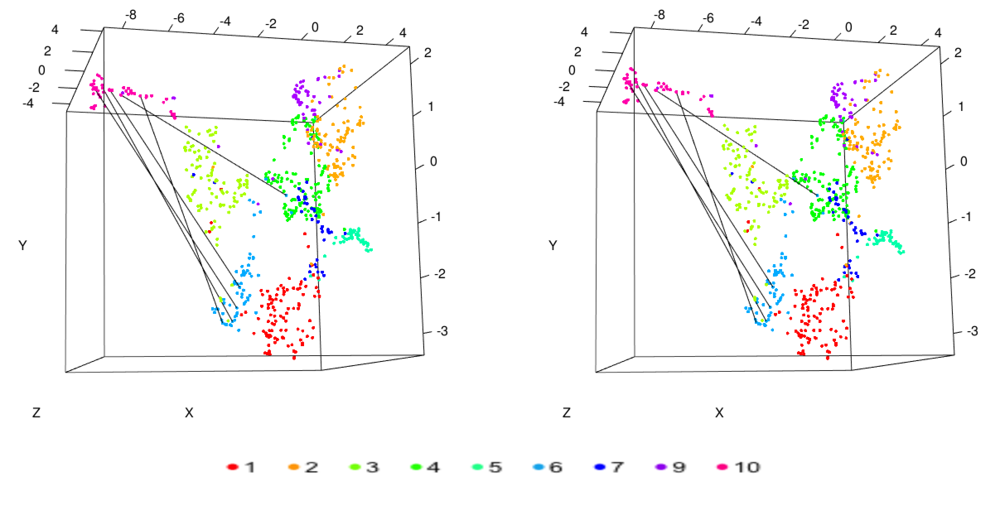
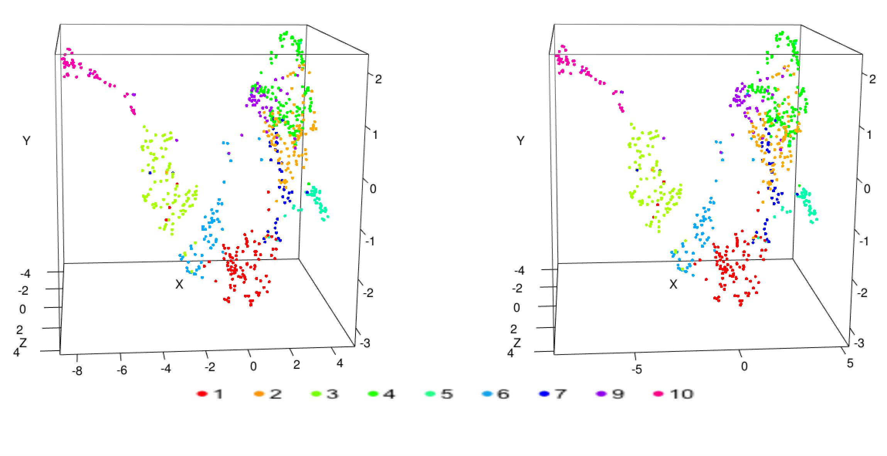
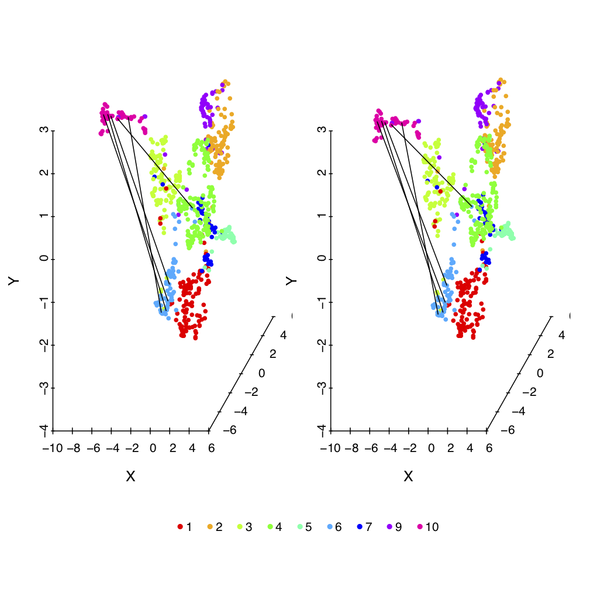

---
output:
  md_document:
    variant: markdown_github
  html_document:
    df_print: paged
  word_document: default
  pdf_document:
    highlight: default
---

<!-- README.md is generated from README.Rmd. Please edit that file -->

```{r, echo = FALSE}
knitr::opts_chunk$set(
  collapse = TRUE,
  comment = "#>",
  fig.path = "README-",
  results = "hide"
)
```


## 1. Introduction:
Visualization in three-dimensional (3D) space is a standard and critical process for examining the complex structure of high dimensional data. Stereo imaging technology can be adopted to enhance 3D representation of any complex data, especially those consisting mostly of points and lines. We illustrate the simple steps that are involved and strongly encourage others to implement it in their own visualization software. To facilitate its application, we have also created a new software that can convert a regular 3D scatterplot or network figure to a stereo image

## 2. Concept:
When 2D-image of original data and the slightly rotated data are viewed side by side a 3D illusion is created due to two perspectives of the same object.

The original set of coordinates $(X, Y, Z)$ can be rotated (counter-clockwise direction) by an angle $\theta$ along Y-axis using the rotation matrix $R_y (\theta)$. The new set of coordinates is obtained as

$$
\begin{aligned}
\begin{bmatrix}
X^` \\ Y^` \\ Z^` \\ 1
\end{bmatrix}  & =
R_y (\theta) \cdot
\begin{bmatrix}
X \\ Y \\ Z \\ 1
\end{bmatrix}  \\
& =
\begin{pmatrix}
cos \theta & 0 & -sin \theta & 0\\
0 & 1 & 0 & 0\\
sin \theta & 0 & cos \theta & 0\\
0 & 0 & 0 & 1
\end{pmatrix} \cdot
\begin{bmatrix}
X \\ Y \\ Z \\ 1
\end{bmatrix}
\end{aligned}
$$


## 3. Availability and Installation

The development version of `Stereo3D` package is available at https://github.com/bioinfoDZ/Stereo3D  and can be installed as

```{r gh-installation, eval = FALSE}
# install.packages("devtools")
devtools::install_github("bioinfoDZ/Stereo3D",build_vignettes = FALSE )
```

## 4. Functions

### 4.1  Stereo3D

####**Description**
Create Stereoscopic 3D image of the given data.

####**Usage**
`Stereo3D(data_file=sample_data_file, stereo_angle=15, distance=0, connection_file=connection_fileNam)`

####**Arguments **
- `data_file`:	 A tab seperated file with `".tsv"` extension and having five columns (`index`, `X`, `Y`, `Z` and `Color`) of the data. Where, `X`, `Y` and `Z` represent cordinates of a datapoint, `Color` is the label of the given data point and `index` clolumn have the index information of the datapoints.
- `stereo_angle`:  angle by which 3D data to be rotated along Y-axis. `Default: 5 degree`
- `distance`: Distance or gap between the two stereo images.
- `connection_file`: A tab seperated file (optional). Where, `first` and `second` column has indices of start and end points (from `data_file`) of a connection respectively.

####**Details**
The dataset is rotatated by a given angle along the Y-axis and a Stereoscopic 3D scatter plot image is created.

####**Value**

- Create Stereoscopic 3D plot with `input data filename prefix` and `_Stereo.pdf` extention.
- Interactive 3D plot of the above image, which can be zoomed and rotated by draging the mouse.

####**Examples**

```
> connection_fileName=system.file("extdata", "connection_file.tsv",
package = "Stereo3D", mustWork = TRUE)
> sample_data_file=system.file("extdata", "sample_3D_data.tsv",
package = "Stereo3D", mustWork = TRUE)

> Stereo3D(data_file=sample_data_file, stereo_angle=5, distance=0,
connection_file=connection_fileName) # dataset stereo image is created
and saved in "sample_3D_data_Stereo.pdf"
```

#### Output








